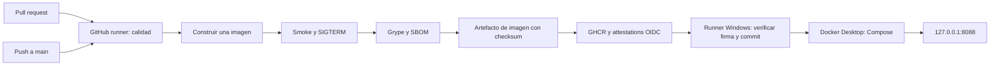

# Arquitectura y decisiones

## Aplicación

`src/domain/quote.ts` concentra reglas puras y validación del contrato. `src/http/app.ts` adapta HTTP, errores, métricas y logs. `src/main.ts` configura el puerto y el cierre ordenado. No hay bibliotecas de ejecución que deban copiarse al contenedor. Se utilizan dependencias de desarrollo para compilación, lint y cobertura.

## Contenedor

La etapa `build` instala exactamente el lockfile y compila con Node 24 Debian Slim. La etapa `runtime` usa la imagen mínima de Node de Chainguard, copia solamente el JavaScript compilado y `package.json`, usa `USER 65532:65532` y arranca `/usr/bin/node` directamente para recibir SIGTERM. Ambas bases y el frontend Dockerfile están fijados por digest. Dependabot propone actualizaciones; CI vuelve a comprobarlas.

Los scans bloquearon las bases generales Alpine y Debian por vulnerabilidades en herramientas y bibliotecas del sistema. El runtime utiliza una base mínima mantenida específicamente para ejecutar Node, conservando el gate de severidad alta/crítica sin excepciones. El healthcheck tiene formato exec y no necesita una shell. [Referencia de la imagen](https://images.chainguard.dev/directory/image/node/overview).

Compose limita RAM a 128 MiB, CPU a una unidad y procesos a 64. El sistema de archivos es de solo lectura, las capacidades se eliminan y se impide ganar privilegios. `/tmp` es un tmpfs limitado. El puerto del host escucha en `127.0.0.1`; Docker Desktop ejecuta un contenedor Linux dentro de su entorno administrado.

La imagen se construye una vez por ejecución de CI. Se exporta con checksum SHA256 y su ID; `publish` comprueba ambos, carga el mismo contenido y lo publica. Se genera un SBOM de esa imagen y una attestation firmada para el digest publicado. Esto permite verificar quién la publicó y con qué workflow antes de ejecutarla.

## Despliegue

El runner local no compila ni hace pruebas de pull requests: recupera la referencia inmutable publicada por CI. El job requiere el repositorio de origen, `main`, CI exitoso y el entorno `local-laptop`. La verificación de procedencia exige el workflow CI del repositorio, un firmante alojado en GitHub y, en despliegue automático, el commit esperado.

Compose reemplaza un único servicio. Hay una breve interrupción al reemplazarlo; no se presenta este ejemplo como un despliegue sin interrupciones. El script conserva el digest estable y, ante fallo de readiness o prueba funcional, restaura la versión anterior. Un fallo de descarga ocurre antes de tocar el contenedor.

No se añade Kubernetes para ejecutar un servicio local sin estado. El mismo artefacto puede desplegarse después en una VM o plataforma de contenedores, cambiando el adaptador de despliegue y las comprobaciones del destino.
